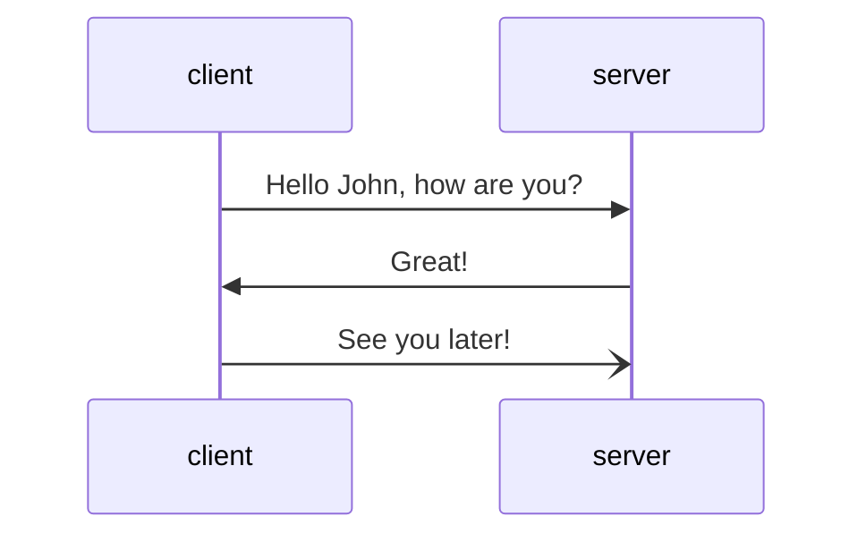

# Wavelet

**Wavelet is simple and scalable web framefork.**

*Your work is directed by the visions of other people, constricted by deadlines, and subjected to constant criticism.*

## Features (Roadmap)

- WSGI compatible application
- Controllers: class based, functions/decorators
- Routing
- Dependecy Injection
- Background Processes
- Live Reload on file change
- Visual/Textual + Dashboard

- Architecture and Patterns
  - Domain Driven Design patterns: Repository, Transaction (Unit of Work), Mediator (Message Bus)
  - Clean Architecture
  - Event Driven Architecture
  - Event Sourcing and/or CQRS

## Design

Wavelet framework je postaven na jednoduché myšlence, a to, že naše webová aplikace má podobu stromu/grafu skrze kterým tečou data. Cesta od HTTP dotazu až po odpověď je možné chápat jako *pipeline*. 

Vstupním bodem je vždy instance třídy `Wavelet` a všechny požadavky zaslané klientem jsou webovým serverm delegovány na tuto (singleton) instanci. Přesněji řečeno je zavolána metoda `__call__()`, které jsou dle specifikace WSGI předáný dva parametry 1) `environ` a 2) `start_response`. 

Příklad:

Klient na danou URL zašle požadavek v podobě HTTP dotazu např.  

    http://localhost:8080

kde  webový server ho předá. Z něho je vytvořena instance třídy `Request`. Tato instance je dále poslána na do instance `Wavelet`, která vybere odpovídající kontroler `Controler/Handler`. Kontroler zpracuje/obslouží dotaz
a vrací instanci třídy `Response`.

### Routing

Pokud navštívíme URL adresu na které naslouchá náš server měl by nám odpovědět.

## HTTP 

Hypertext Transfer Protocol (HTTP) je slouží k ... a je založen na client-server architektuře.

- DNS; TCP, TLS; UDP, IP

### Resources a URL

- URI: URL, URN

URL může být např. `http://localhost:8051/`.

URL se skládá z pěti částí: 
- scheme (protocol)
- subdomain
- top-level domain
- second-level domain
- subdirectory (path)

    https://blog.website.com:8080/news?user=1&lang=en
                                      ^^^^^^query-params       
                                 ^^^^subdirectory
                            ^^^^^port 
                         ^^^top-level domain
                 ^^^^^^^^second-level domain                 
            ^^^^^subdomain
    ^^^^^^^^schema  

. scheme
. netloc
. path
. query
. fragment

### HTTP Header

### HTTP Request

### HTTP Response

## WSGI

### Co je WSGI?

WSGI bylo navrženo jako rozhraní mezi serverem a aplikací/frameworkem.

WSGI API má dvě strany: 1) server/gateway 2) application/framework.

1) Obvykle web server: Appache, Nginx atd.
2) Python `callable` (funkce, třída, metoda)

Mezi serverem a aplikací může být vmístěn middleware komponenty, který musí implementovat obě strany API.

### Co je to WSGI Middleware?

Proměnná `environ` je slovník (`dict`), který je naplněn při každém dotazu klienta ne server.
Obsahuje klíče a hodnoty naplněné CGI proměnnými prostředí (environment variables) a parametry z requesti a metadaty.

Proměnná `start_response` je callable přebírající dva poziční parametry a to `status` a `response_headers`.

Pokud je uvedena hlavička `Content-Length`, pak musí obsahivat skutečnou délku posílaného textu! Prohlížeč usekne obsah na uváděné délce tzn., 
že pokud posíláme text délku 20 a uvedeme 10, pak uvidíme jen půlku z tohot textu.

## Resources

- https://github.com/django/django
- https://github.com/starlite-api/starlite
- https://github.com/pallets/flask
- https://github.com/pallets/werkzeug
- https://github.com/bottlepy/bottle

HTTP
- https://www.ibm.com/docs/en/cics-ts/5.1?topic=concepts-components-url
- https://www.ietf.org/rfc/rfc2396.txt
- https://www.ibm.com/docs/en/cics-ts/5.1?topic=concepts-http-protocol

CGI
- https://www6.uniovi.es/~antonio/ncsa_httpd/cgi/env.html
- https://www6.uniovi.es/~antonio/ncsa_httpd/cgi/examples.html

WSGI
- https://en.wikipedia.org/wiki/Web_Server_Gateway_Interface
- https://lwn.net/Articles/792882/
- 
- https://docs.python.org/3/library/wsgiref.html

- https://developer.mozilla.org/en-US/docs/Glossary/HTTP_header

- https://en.wikipedia.org/wiki/List_of_HTTP_header_fields

- https://github.com/ryanwilsonperkin/wsgi-tutorial/